# Customization

This page will explain all configuration available and how to edit each section appear on theme. Let's view the first homepage.

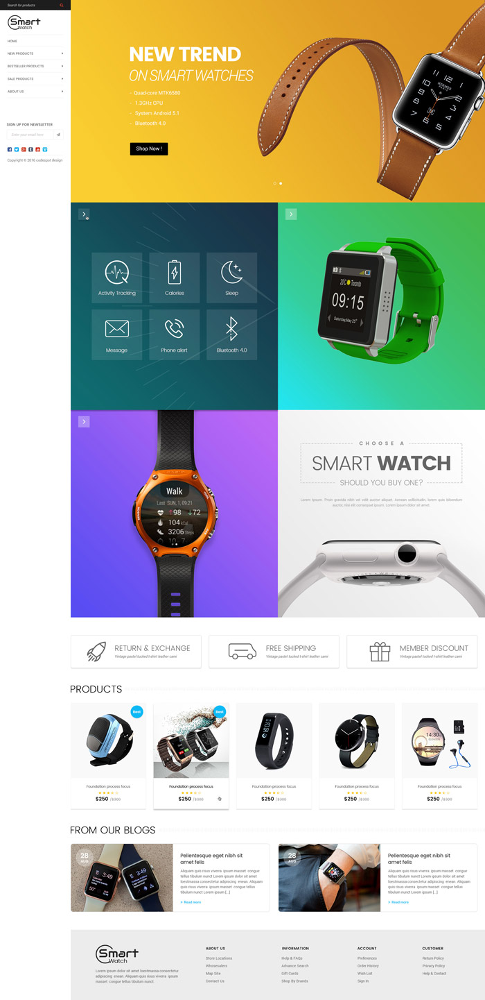

## Top Banner

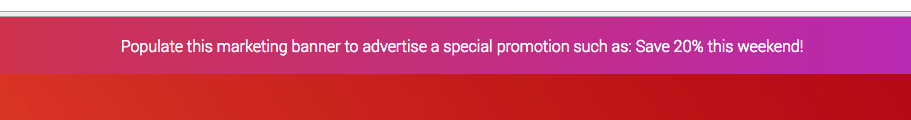

The top banner can be showed / edited in admin page > __Marketing__ > __Banners__. When you add / edit remember to choose __Location__ is __Top of Page__.

### Colors Customization

To customize colors of this section, go to admin page > __Storefront Design__ > __My Themes__, click button __Customize__ of the current theme to open the Theme Editor. 

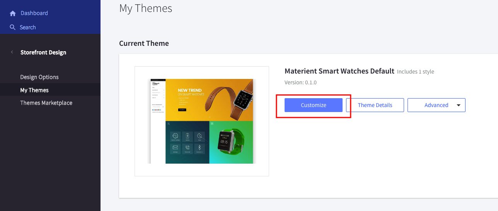

Look into the options showing below:

## Header Sidebar

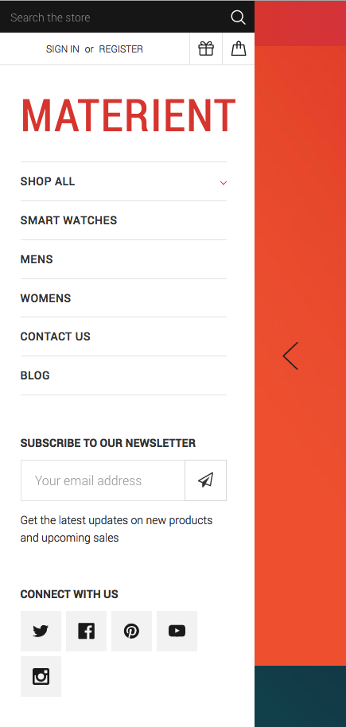

This theme has header on the left sidebar.

### Colors Customization

To customize colors of the header section, look into the options showing below in the Theme Editor:

### Show / Hide newsletter form

To show or hide newsletter form on the header sidebar, open Theme Editor > __Header__ section, check or uncheck below option:

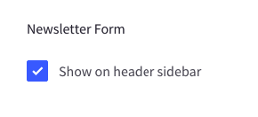

### Show / Hide social media icons

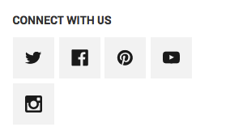

To show or hide the social icons on the header sidebar, open Theme Edtior > __Social media icons__ section, toggle option __Header sidebar__ as below:

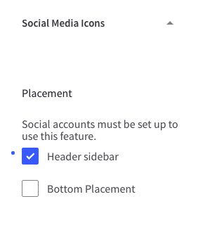

Drag and drop social media icons you want to display in admin page > __Storefront Design__ > __Design Options__:

## Main Slideshow / Carousel

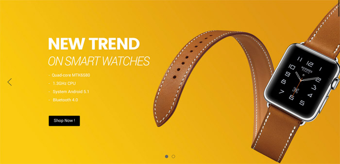

### Edit the slideshow

Edit the slideshow in admin page > __Storefront Design__ > __Design Options__:

### Colors Customization

To customize color of the slideshow's elements, look into section __Carousel__ in the Theme Editor:

### Hide the slideshow

To hide the slideshow on homepage, uncheck on the checkbox __Show Carousel__ in section __Carousel__ of the Theme Editor.

## New / Featured / Popular Products

The theme supports 4 layout type of __New Products__, __Featured Products__ and __Popular Products__ blocks:

__Grid__:

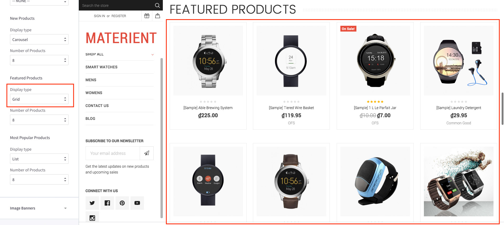

__Carousel__:

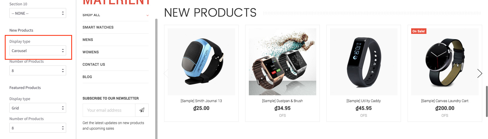

__List__:

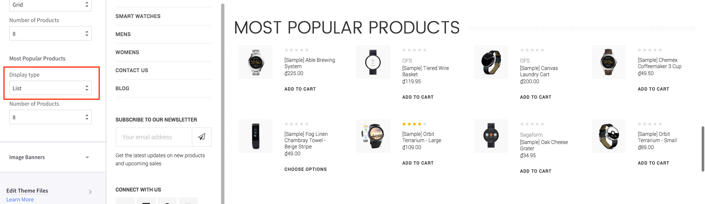

### Configure a Layout Type of products block & Number of Products to show up

In the __Theme Editor__ > __Homepage__, look into __New Products__ section (or __Featured Products__, __Most Popular Products__):

- __Display type__: Choose appropriate layout type (__Grid__, __Carousel__, __List__).
- __Number of Products__: Choose number of products to show up.

### Show/Hide Quickview button

When hover on a product item, Quickview button is showed up by default. To disable this feature, uncheck the checkbox __Show Quickview__ in the __Theme Editor__ > __Products__ section.

### Change colors and image sizes

In the __Theme Editor__ > __Products__ section, Look into the color options below __Product cards__, __Product Sale Badges__, __Product cards (Quick search)__ and __Image sizes__'s options.

### Change the heading text

To change the heading text (New Products, Featured Products, Most Popular Products), edit the language file, look for the key `products` > `new` or `featured` or `top`.

## Image Banners

Theme supports many banner styles:

__2 Banners with Metro style__:

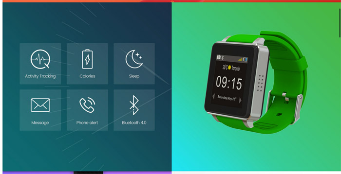

__2 Banners with boxed style__:

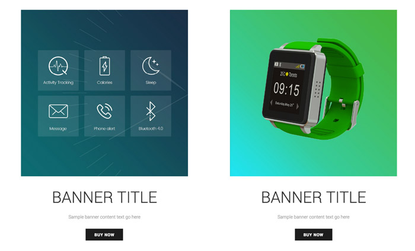

__2 Banners with default style__:

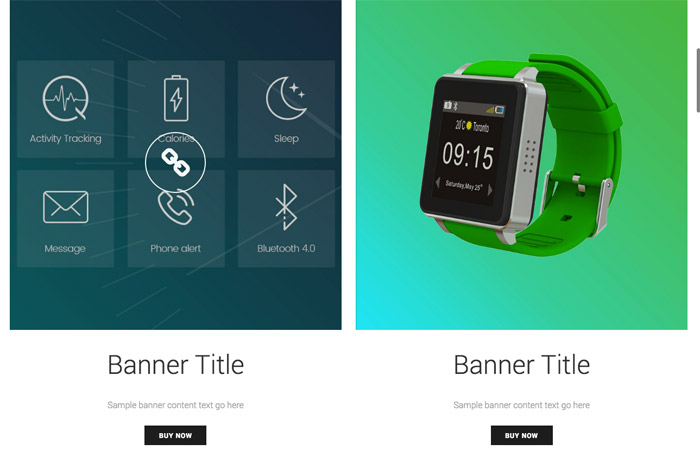

__3 Banners with rounded border and right icons__:

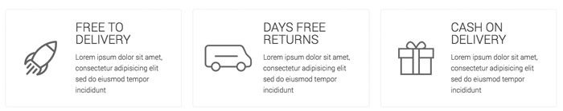

__Fullwidth Banner__

### Change banner style and colors

To change banner style and background colors, open Theme Editor > __Image Banners__ section:

Theme support 3 banner layouts: 

- __2 banners per row__
- __3 banners per row__
- __full-width banner__

You can show up to __5 banner groups__ with same layout.

Each banner layout can has 4 styles:

- __Default__
- __Boxed__
- __Metro__
- __Rounded Box & Right Icon__

### Edit banner images and text

To change banner images and text, edit the language file `en.json`, find keys `emthemesmodez` > `banners`:

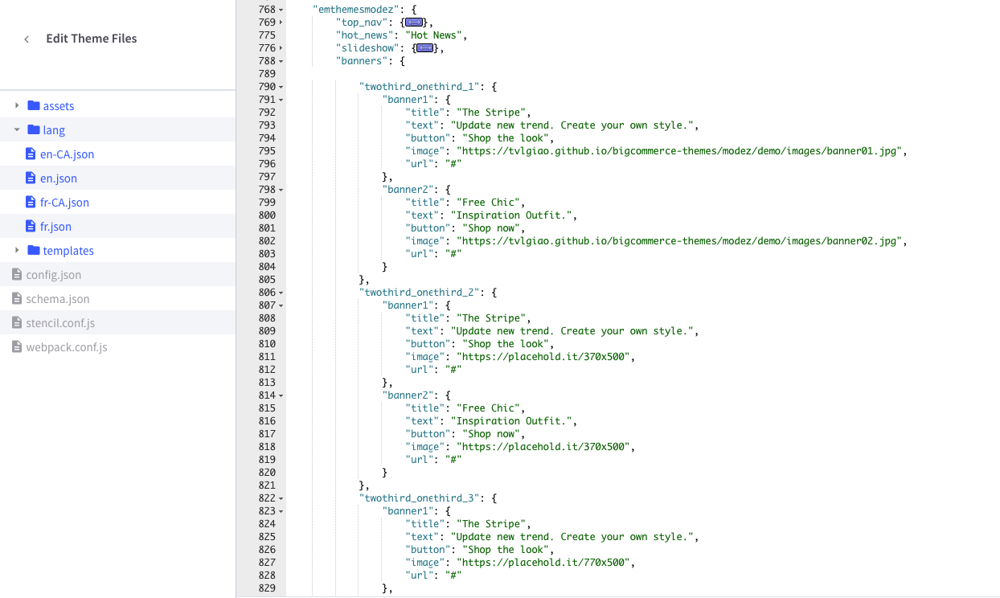

Banner layouts:

- group `half_1` to `half_5`: represent 5 instances of 2 half-size banners.
- group `onethird_x3_1` to `onethird_x3_5`: represent 5 instances of 3 one-third size banners.
- group `one_1` to `one_5`: represent 5 instance of fullwidth banner.

Banner image and text:

- key `title`: is banner text title. Leave a single space character to hide it.
- key `text`: is banner content text. Leave a single space character to hide it.
- key `button`: is button text. Leave a single space character to hide it.
- key `image`: is banner image.
- key `url`: is banner link URL.

## Image Carousel

To edit image and links in this image carousel section, edit the language file, find key `emthemesmodez` > `image_carousel`

- `image*`: is link to the image.
- `title*`: is image text description.
- `url*`: is image link. Leave a single space letter in the value if you want to hide any image.

## Recent Blog Posts

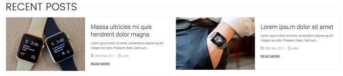

This block show the most recent blog posts.

### Customize heading text and other text

To change the heading text, read more text and date format, edit the language file. Find the key `blog` > `recent_posts`, `posted_by` and `read_more`, edit its values as you want.

## Footer

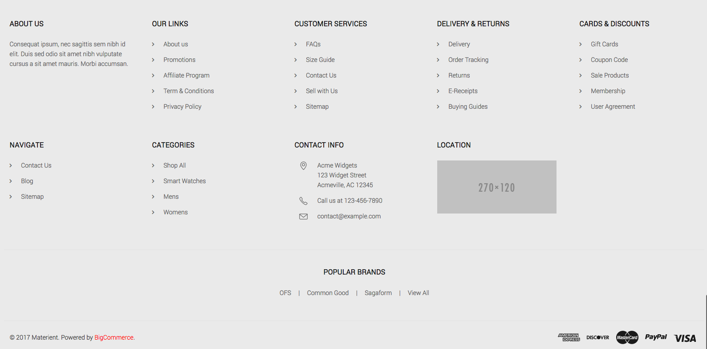

### Toggle on/off any block

You can show or hide any blocks in the Theme Editor > __Footer__ section:

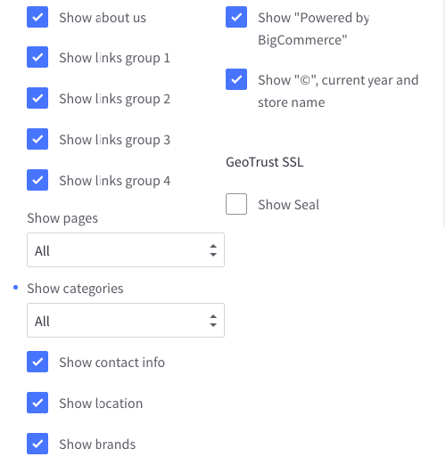

### Edit footer contents

To edit footer links, edit the language file `en.json`, find keys `emthemesmodez` > `footer`

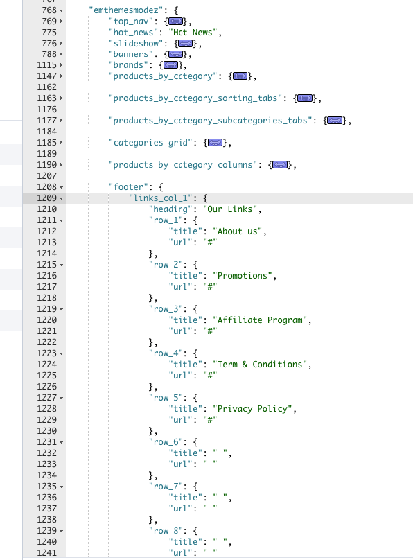

- `links_col_1` to `links_col_4`: represent 4 links columns.
- `title` & `url`: are link text and URL. Leave a single space character to hide.

### Colors customization

You can change footer text and background color in Theme Editor > __Footer__ section:

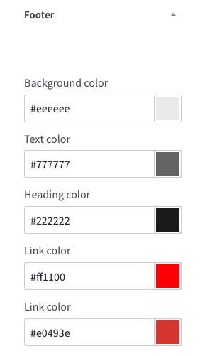

## Edit footer template

If you want more control about the footer, you can edit the footer template at `templates` > `components` > `common` > `footer.html`:

