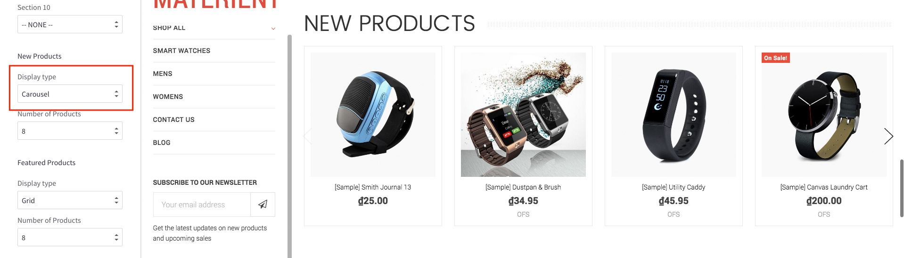
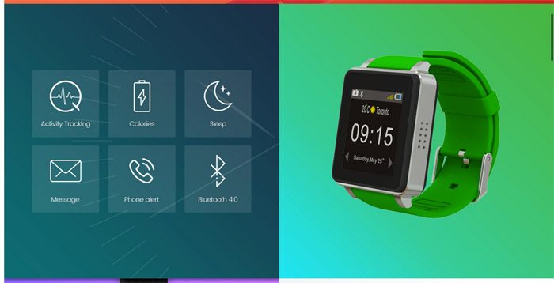

# Block Sections

This is a powerful and unique feature of the theme, let you rearrange contents, show/hide contents block on the homepages without editing the theme's source code. And __No HTML/CSS programming knowledge required__.

In the __Theme Editor__ > __Homepage__. There is 10 sections (or placeholder), where you can pick a content block to show on.

- __Section 1__ is a placeholder which only support __Carousel__ block - the main image slideshow.
- __Section 2__ to __Section 10__ are placeholder which support the following blocks:
	+ __New Products__
	+ __Featured Products__
	+ __Popular Products__
	+ __1st 3 Banners__
	+ __2nd 3 Banners__
	+ __3rd 3 Banners__
	+ __4th 3 Banners__
	+ __5th 3 Banners__
	+ __1st 2 Banners__
	+ __2nd 2 Banners__
	+ __3rd 2 Banners__
	+ __4th 2 Banners__
	+ __5th 2 Banners__
	+ __1st Fullwidth Banner__
	+ __2nd Fullwidth Banner__
	+ __3rd Fullwidth Banner__
	+ __4th Fullwidth Banner__
	+ __5th Fullwidth Banner__
	+ __Recent Blog Posts__
	+ __Brands Carousel__
	+ __Images Carousel__

## New / Featured / Popular Products Blocks

The theme supports 3 layout type of New Products, Featured Products and Popular Products blocks:

- Grid
- List
- Carousel

__Products Grid__:

__Products List__:

__Products Carousel__:

## Image Banners

The theme supports these type of banner blocks:

- 2 Banners with half size column.
- 3 Banners with the same size 1/3 column.
- Full width banner.

__2 Banners with Metro style__:

__2 Banners with boxed style__:

__2 Banners with default style__:

__3 Banners with rounded border and right icons__:

__Fullwidth Banner__

Each banner type supports up to 5 instances.

## Recent Blog Posts

This block show the most recent blog posts.

## Images Carousel

This section lets you show up images carousel. You can edit images and links in the language file as determined in [Customizing Images Carousel](customization.md#image-carousel)

## Brands Carousel

